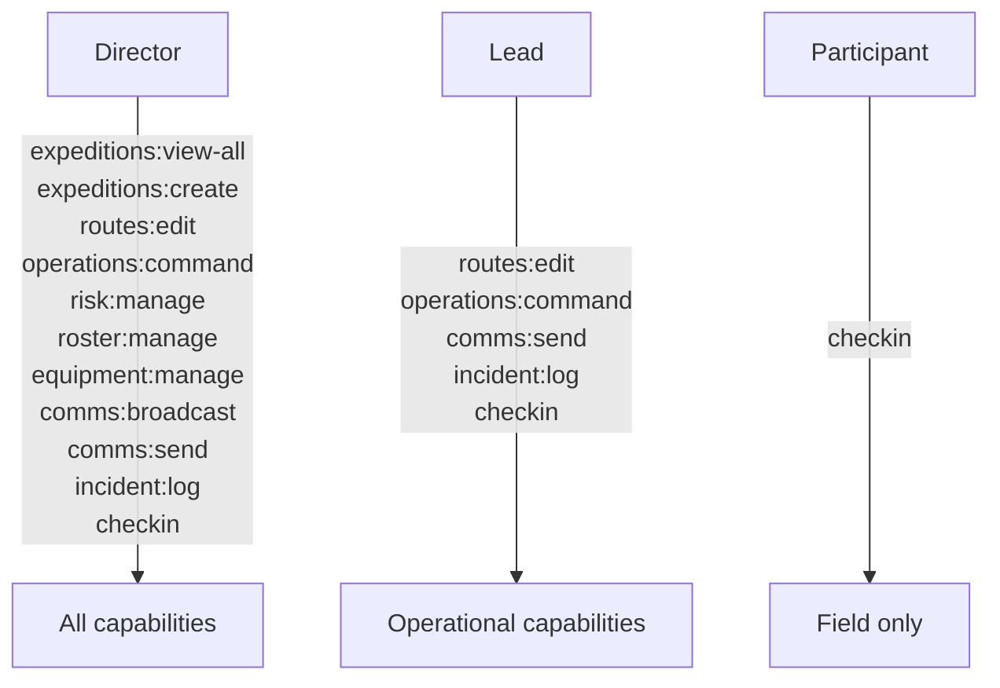
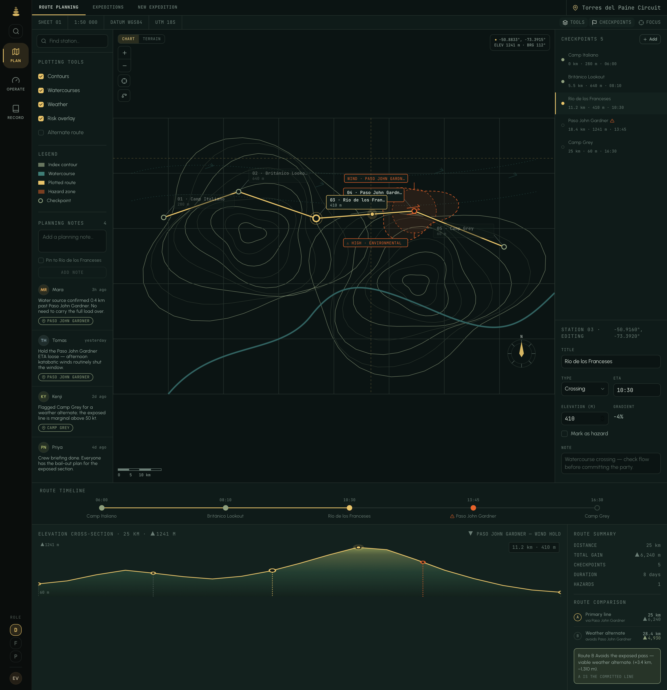
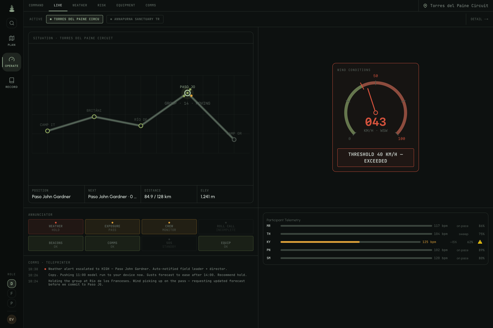
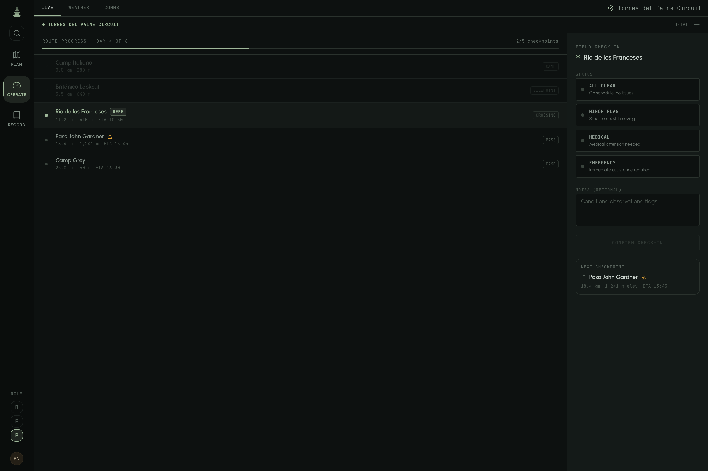
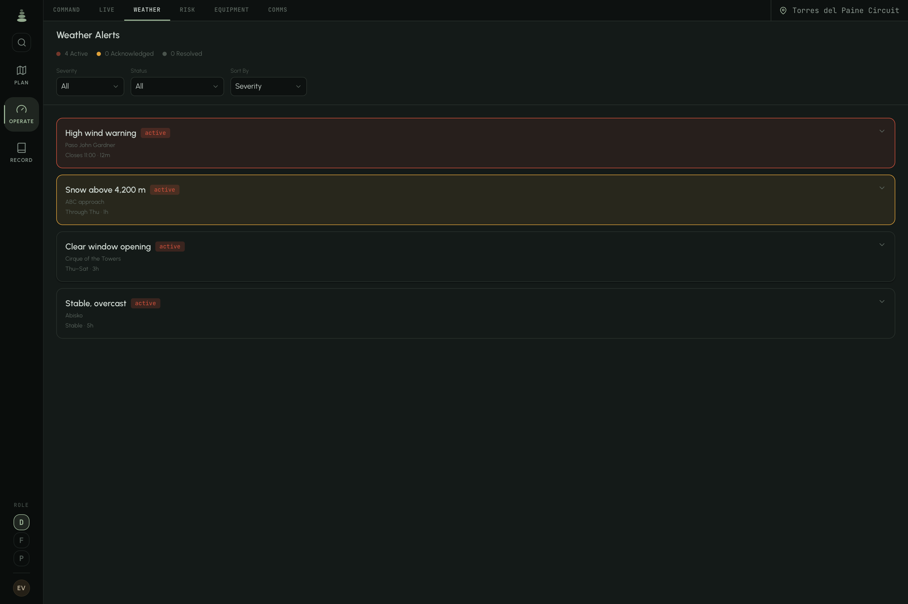
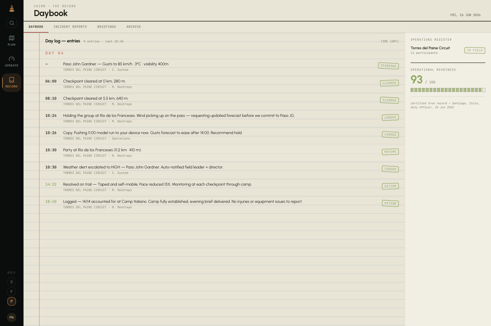
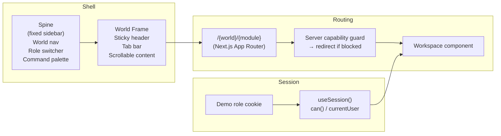
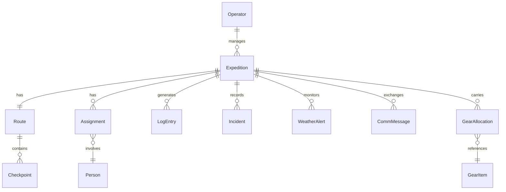

# Cairn

**[Live demo →](https://cairn-expedition.vercel.app)**

---

## What is Cairn?

Cairn is the back-office software for a mountaineering expedition company. It gives three types of users — directors, field leads, and participants — a shared but role-scoped view of the same operational universe.

Cairn is designed to _feel alive_: real expeditions are being planned, tracked, and archived. Data is relational and consistent across every screen. Switching roles changes not just what you can do, but what you see.

Expedition management was chosen as the domain deliberately — it spans the full operational lifecycle and demands every hard class of enterprise problem at once: strict role-based access, time-sensitive coordination, live tracking, incident management, and post-expedition archiving. Most enterprise applications touch one or two of these. This one has all of them.

---

## The three worlds

Cairn is organised into three top-level contexts — **Plan**, **Operate**, and **Record** — each with its own set of modules. The active world sets the colour theme and available tabs.

```
┌─────────────────────────────────────────────────────┐
│  SPINE  │              WORLD FRAME                  │
│  ──────  │  ┌──────────────────────────────────┐    │
│  Plan   │  │  Tab bar  (world modules)          │    │
│  Operate│  │  ──────────────────────────────── │    │
│  Record │  │                                    │    │
│         │  │         Active workspace           │    │
│  ──────  │  │                                    │    │
│  Role   │  └──────────────────────────────────┘    │
│  Switch │                                           │
└─────────────────────────────────────────────────────┘
```

### Plan

Route planning and expedition management before departure.

| Module         | What it does                                                      |
| -------------- | ----------------------------------------------------------------- |
| Route Planning | Interactive checkpoint timeline, elevation profile, terrain stats |
| Expeditions    | Card grid of all expeditions with status and readiness indicators |
| New Expedition | Expedition builder — director/lead only                           |

### Operate

Live operations centre during active expeditions.

| Module    | What it does                                                        |
| --------- | ------------------------------------------------------------------- |
| Command   | High-level overview: active expeditions, KPIs, risk summary         |
| Live      | Real-time situation panel, wind anemometer, annunciator, comms feed |
| Weather   | Alert management with acknowledge/respond workflows                 |
| Risk      | Risk register with severity matrix                                  |
| Equipment | Gear manifest and allocation tracking                               |
| Comms     | Multi-channel message feed with composer and org broadcast          |

### Record

The permanent operational archive after expeditions complete.

| Module           | What it does                                                       |
| ---------------- | ------------------------------------------------------------------ |
| Daybook          | Cross-expedition chronological log, grouped by day                 |
| Incident Reports | Formal incident documents with expedition context                  |
| Briefings        | Pre-departure briefing packets for upcoming expeditions            |
| Archive          | Historical expedition index with selectable detail panels          |
| Metrics          | Aggregated statistics: completion rates, distances, incident rates |

---

## Role system

Three roles, one capability list. Screens ask `can("capability")` — they never check role directly.



What this means in practice:

|                                 | Director |      Lead      |  Participant   |
| ------------------------------- | :------: | :------------: | :------------: |
| Sees all expeditions            |    ✓     |       —        |       —        |
| Creates expeditions             |    ✓     |       —        |       —        |
| Command / Risk / Equipment tabs |    ✓     |       —        |       —        |
| Live operator workspace         |    ✓     |       ✓        |       —        |
| Live check-in panel             |    —     |       —        |       ✓        |
| Acknowledge weather alerts      |    ✓     |       ✓        |       —        |
| Send comms                      |    ✓     |       ✓        |       —        |
| Org broadcast                   |    ✓     |       —        |       —        |
| Metrics tab                     |    ✓     |       —        |       —        |
| Record world (scoped)           |   All    | Own expedition | Own expedition |

Tab-level gating uses `requiredCapability` on the module definition. URL-level gating runs server-side and redirects to the first accessible module.

---

## Product tour

Suggested captures — each chosen to show a specific product or engineering decision:

| Screen                | Role        | What it demonstrates                                                          |
| --------------------- | ----------- | ----------------------------------------------------------------------------- |
| Plan → Route Planning | Director    | Checkpoint timeline, elevation profile, `canEdit` capability gates in action  |
| Operate → Live        | Director    | Full operator workspace: situation panel, wind anemometer, annunciator, comms |
| Operate → Live        | Participant | Same route, same expedition — entirely different workspace                    |
| Operate → Weather     | Lead        | Alert acknowledge/respond workflow with response history                      |
| Record → Daybook      | Director    | Cross-expedition chronological log with per-expedition colour coding          |
| Role switcher         | —           | Same URL, three different views of the same data                              |

The Live module is the best place to start: switch between Director and Participant to see the same expedition rendered through two completely different lenses.

---

## Screenshots

### Plan — Route Planning



### Operate — Live (Director)



### Operate — Live (Participant)



### Operate — Weather



### Record — Daybook



---

## Key engineering decisions

**Worlds as a first-class concept.** The three-world structure isn't a nav pattern — it's enforced in the type system. `WorldKey` and `Capability` are string literal unions; adding a new world or capability is a one-line change that TypeScript validates end-to-end.

**Capabilities over roles.** Components never branch on `role === "director"`. They call `can("operations:command")`. This keeps role logic out of UI code and means roles can be redefined without touching components.

**Seeded universe.** All data is generated from a single seed string. Every build produces the same 10 expeditions, same people, same incidents. This makes screenshots, demos, and debugging reproducible without a database — and means the entire application ships as a pure static front-end with nothing to configure or deploy.

**Relational data model.** The universe is not a bag of mock arrays. Assignments link people to expeditions; log entries reference incidents; gear allocations reference catalog items. Navigating between screens reveals consistent relationships — the same participant appears in the roster, the manifest, and the logbook.

---

## Architecture

### App shell



### Data layer

Cairn has no backend. A single seeded generator (`UNIVERSE_SEED = "cairn-northwind-2026"`) produces a deterministic, relational world of ~10 expeditions, ~50 people, routes, checkpoints, gear, weather alerts, incidents, comms, and logs that all reference each other by ID.



All queries go through a typed query layer (`getLogbook()`, `getRoster()`, `getCheckpoints()`, etc.) — components never touch the raw universe tables. Session check-ins are written to a module-level store (`checkin-store.ts`) that notifies subscribers, giving real-time propagation between the participant's check-in panel and the leader's expedition detail feed.

### Feature structure

```
src/
├── app/
│   └── (shell)/[world]/[module]/page.tsx   ← single dynamic route for all workspaces
├── features/
│   ├── shell/          ← spine, world frame, shell layout
│   ├── session/        ← role cookie, capabilities, useSession hook
│   ├── theme/          ← world/module definitions (WORLDS constant)
│   ├── plan/           ← route planning, expeditions, builder
│   ├── operate/        ← live, command, weather, risk, equipment, comms
│   ├── record/         ← daybook, history, incidents, briefings, metrics
│   └── command-palette/
└── universe/
    ├── generators/     ← seeded data generation
    ├── types/          ← Expedition, Person, Route, LogEntry, …
    ├── queries.ts      ← relational query layer
    └── universe.ts     ← singleton accessor
```

---

## Tech stack

|           |                                                                  |
| --------- | ---------------------------------------------------------------- |
| Framework | Next.js 16 (App Router)                                          |
| Language  | TypeScript 5 (strict)                                            |
| Styling   | Tailwind CSS v4 — no CSS modules, no inline styles               |
| State     | React local state + module-level stores for cross-component sync |
| Data      | Deterministic seeded universe                                    |
| Auth      | Cookie-based demo role switcher                                  |

---

## Running locally

```bash
npm install
npm run dev        # development server on :3000
npm run build      # production build
npx tsc --noEmit   # type check
```

Open [http://localhost:3000](http://localhost:3000). Use the **role switcher** at the bottom of the left sidebar to switch between Director, Lead, and Participant views without logging in.

No environment variables required. No database. No external services.

---

> **About.** Cairn is a portfolio project built to demonstrate full-stack product engineering — real-world UX complexity, role-based access control, a deterministic relational data model, and a coherent three-world information architecture. There is no real company behind it, no real expeditions, and no backend — just a seeded universe and a well-structured front-end.
